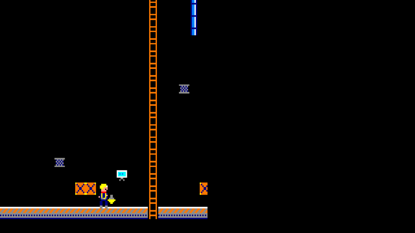
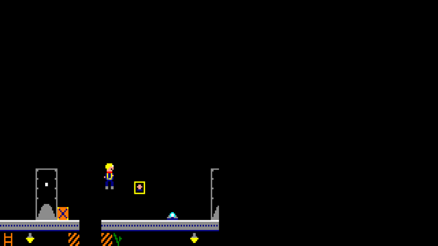
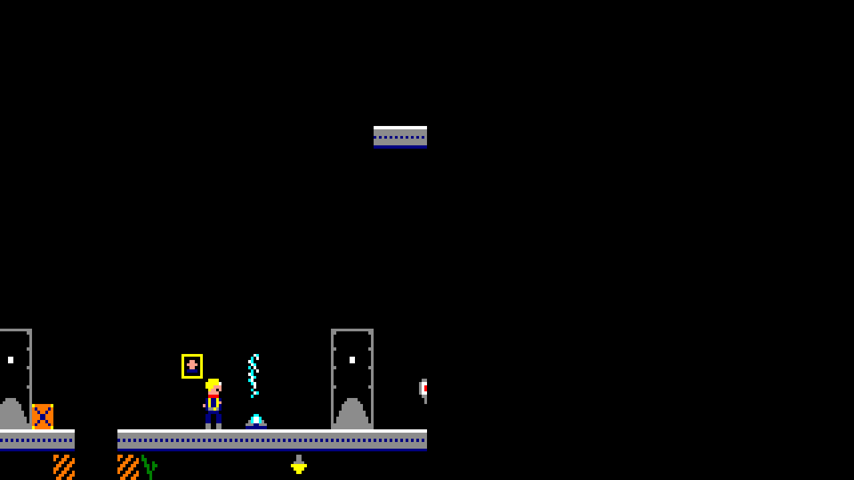
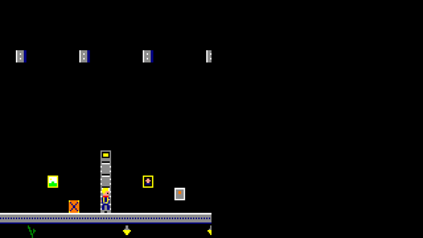
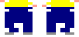
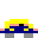
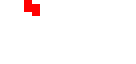
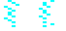

# THE SHAFT

A 2D flip-screen vertical platformer for the **Amstrad CPC 6128**, written in Z80
assembly. Climb from the grease-black machine decks at the bottom of a miles-deep
concrete cylinder to the sealed airlock at its top — and find out what the elite
have been lying about.

## Premise

Humanity has lived for generations inside the Shaft. The surface is taught to be
toxic and lethal. Mechanics keep the great pumps alive at the bottom; the
agricultural terraces feed everyone from the middle levels; the elite rule from
the light-flooded top. You are a bottom-level mechanic who has found a forbidden
artifact proving the official history is a lie. There is only one way to the
truth: **up**.

## The demo disc

A second, separate disc holds a scripted run for video capture. The
mechanic is pinned to a fixed slot near the bottom of the frame and the
world slides around him: he **walks out along the bottom floor**, climbs
**a long ladder** (3 s), heads along the deck, **jumps a gap**, **waits
out a steam vent**, **throws a switch**, climbs **a second ladder**,
**pockets a yellow keycard** and walks through **the yellow door it
opens** — 12.6 seconds in all. The one sound is a footstep built to a
Locomotive BASIC reference (`ENV 1,3,-5,3` + `SOUND 1,0,2,15,1,0,n`):
noise only, the noise period alternating 26 and 22 for the left and
right boot — and a duration of 2, which cuts the envelope at its first
step: one dry tick at volume 15, gone at the next update. It is struck
ON the leg swap and cut in real 50 Hz frames, so neither its pace nor
its length follows the redraw cost. It is built from the game's own
tileset and compiled sprites; nothing is drawn twice.

```sh
./build_demo.sh     # -> build/theshaftdemo.dsk, then RUN"DEMO
```

 
 

A frame-accurate capture is in [docs/demo.mp4](docs/demo.mp4)
(1280×720, 50 fps).

**How it is framed and drawn.** CRTC R6 is cut to 19 character rows, so
the active picture is a 152-line band — 1.754:1, within about a percent
of 16:9. A full redraw of that band is ~420 tiles, roughly five frames'
work, so the set is held as a sparse *object list* instead of a tilemap:
each update erases every object at the camera position this buffer last
saw and redraws it at the current one. Beats that change the set (the
lever, the card, the door) just patch tile bytes in that list.
`tools/demo_scene.py` simulates the whole script and refuses to emit a
set that would break the frame budget (it peaks at 79 of an affordable
80) or a run whose beats do not land the mechanic on the thing they are
about — that the jump leaves before the hole and lands past it, that he
waits clear of the vent, that the door's indicator light is the colour
of the card he just took. The camera is 24-bit fixed point driven by
the interrupt's 50 Hz frame count rather than by how long a redraw
took, so the beats keep their timing even if the raster is missed.

**Verifying without a CPC.** `tools/z80mini.py` is a Z80 subset big
enough to *execute* the assembled binary, and `build_demo.sh` runs four
harnesses over it:

| | checks |
|---|---|
| `verify_demo.py` | the camera frame by frame, the set edits, and 54 rendered frames against an independent model, pixel for pixel |
| `verify_demo_loop.py` | the **whole** update including the erase pass, proving it never writes outside the screen buffers |
| `verify_demo_sfx.py` | the footstep against the BASIC spec: struck at 15, noise only, alternating 26/22 per boot, cut after its first envelope step and the channel closed — at every realistic update length |
| `verify_demo_timeline.py` | the real main loop from `start:`, asserting what a **listener** would report: step rate, decay length, silence between |

The middle one exists because it was missing: the first verifier only
ever drove the draw half, so a wild row counter in the erase path
reached a real CPC and reset it. `tools/demo_preview.py` renders the
video the same way — the preview is the engine's own output, not a
second implementation that could drift from it.

## The manual and the sleeve

Period documentation, in the style of a mid-80s Amstrad release:

| | English | Ελληνικά |
|---|---|---|
| Manual (markdown) | [docs/manual.md](docs/manual.md) | [docs/manual.el.md](docs/manual.el.md) |
| Manual (print, A5) | [docs/manual.pdf](docs/manual.pdf) | [docs/manual.el.pdf](docs/manual.el.pdf) |

The 3" disc inlay — back face, spine and front cover on one sheet:
[docs/cover.svg](docs/cover.svg) · [docs/cover.pdf](docs/cover.pdf)

Regenerate the PDFs after editing the markdown:

```sh
python3 tools/manual_pdf.py docs/manual.md    docs/manual.pdf
python3 tools/manual_pdf.py docs/manual.el.md docs/manual.el.pdf
```

Where a piracy warning would have gone, both the manual and the sleeve
carry the opposite notice: **copying this disc is permitted and
encouraged.** Software of this vintage survives only because people
copied it.

## Editing the sprites

All 22 sprite frames are exported as ordinary PNGs in
[art/sprites/](art/sprites/), with the 16 CPC pens as an editor
palette ([art/cpc-pens.gpl](art/cpc-pens.gpl)). Edit them in any pixel
editor — [art/README.md](art/README.md) has the workflow, the rules
the importer enforces, and editor recommendations (Aseprite first).

```sh
python3 tools/sprite_export.py   # sprites_art.py -> art/sprites/*.png
python3 tools/sprite_import.py   # ...and back, after editing
./build.sh
```

The round trip is lossless, the importer rejects any colour that is
not a CPC pen (naming the pixel and the nearest pen), and the frame
order the compiled-sprite stub table depends on can never move.

## Building

Requires [rasm](https://github.com/EdouardBERGE/rasm) and
[iDSK](https://github.com/cpcsdk/idsk) on your PATH (override with the `RASM` /
`IDSK` environment variables).

```sh
./build.sh          # -> build/theshaft.dsk
```

Load the DSK in any CPC emulator (Caprice32, WinAPE, ACE, CPCEC, ...) as a
6128 and type `RUN"SHAFT`. That boots the BASIC loader (`src/shaft.bas`):
it draws the REVIVE8BIT title screen (`docs/revive8b.scr`, inks per
`docs/revive8b.txt`), waits for Space — or 10 seconds — then loads and
starts the game.

**Controls:** cursor keys + Space + **Z**, or joystick 0 (fire 1 = jump,
fire 2 = lasso). Walk left/right, climb ladders with up/down (mount-assist
snaps you onto the rails). Space jumps — real ballistic arcs with air
control, head bumps, mid-fall ladder grabs. **Z cracks the cable lasso**:
snares any person on your walkway within 16 pixels, in the direction you
face. **Down ducks** (debris and swings pass over your head), **Down +
direction slides** — a fast low burst, one per press, momentum enough to
carry you off an edge. Platforms have **jumpable gaps**: leap them, or
drop through as a one-floor shortcut — but a fall of more than one floor
costs an energy point (the landing stings, play continues where you hit).
Everyone faces where they walk: the mechanic has a two-frame leg cycle
(walking, a back-view hand-over-hand cycle on ladders, and a stride pose
mid-air), and patrollers carry shield or crowbar on their facing side.
Coat men step every 2nd frame, riot guards every 4th — you can outrun
both.

The climb is fully **bidirectional**: ladders are continuous between
screens, so climbing down off the bottom floor descends to the level
below. Levels 1, 10, 20, 30, 40 and 50 have an **elevator** on the
bottom floor — stand at the door and press up/down to ride between
stops *you have already reached on foot*.

**Health**: you carry energy (5) and lives. Any hit — enemy contact,
falling debris, red lubricant drips from the ceiling pipes (white ones
are just oily water), or a fall of more than one floor — costs one
energy point and grants 3 seconds of immunity (the sprite flickers).
At zero energy a life goes and the tank refills. **Medical crates**
appear every few levels, worth 1–4 points; spill past 5 and the
surplus banks a whole life (cap 9).

**Security doors come in five colours** (green, cyan, yellow, white,
red — tinted by each zone's palette) and their keycards are never
beside them: a door's key waits on a **lower platform, the bottom
floor — or an earlier level entirely**. Levels sow *spare* keys for
doors further up the shaft; 28 doors have no key on their own level at
all. And about **a quarter of all keys sit inside sealed vaults**:
somewhere on an *earlier* level is the wall switch that opens each one
(its state persists for the whole run), so the deepest chains run
switch → vault → door across three different levels. **Red is the
vault colour**: every red key sits sealed behind a switch and no other
colour ever does — red doors are always the deep chains. And the
chains run both ways: about **half the vaults sit 1–3 levels BELOW
their switch** — you throw the lever high, climb back down for the
key (opened doors stay open, so the return is quick), and carry it up
past the switch again. And no
switch is free: each one is guarded by a patrolling enemy, a red leak
overhead, or a steam vent right under the lever. **Opened doors
stay open for the whole run** — every door has a persistent id in a
128-bit ledger, and revisited levels reload with their unlocked doors
already gone (and every key cell has its own id too: **a taken key never reappears** — the supply is exactly what the generator placed, which the build-time verifier proves sufficient). Medical crates
only start appearing from level 20.

**The lasso aims from the cursor**: plain Z whips sideways as before;
hold **up** for a straight overhead snare (2 px wide, 16 tall), or
**up + a direction** for a 45° rising diagonal — all clamped at walls
and roof, all drawn as stepped rope segments. The build-time verifier threads one global key inventory through
the whole 59-level climb, so the forward route always works — and if
you miss a key it is still lying where it was, and what you took you
keep — so with downward travel and the elevators nothing is ever
softlocked. Mechanical runs at most one local pair; Agricultural
introduces cross-level keys; Administrative chains up to three doors a
level. The HUD: key icon with five colour counts (left), level
number, a four-digit **score** (+1 a snared enemy, +2 a pocketed key,
+3 an opened door — capped at 9999), energy bolt, and a heart with
lives (right).

**Speed**: the two per-sprite costs are hand-tuned. The masked blit
walks the sprite data with the *stack pointer* — one `POP` fetches a
mask+data pair in 10 T-states (38 T/byte vs 54, interrupts held off
per sprite). Background restore computes its map and screen pointers
once per area and steps them linearly (+20/+80 a row, +1/+4 a column)
instead of re-deriving addresses per cell — the busier the screen, the
more this matters.

## Technical design

* **Machine:** Amstrad CPC 6128 (Z80A @ 4 MHz, 64K main + 64K banked RAM)
* **Video:** Mode 0 — 160×200, 16 colours, 2 pixels per byte. Chunky and
  colourful; exactly right for an industrial palette of rust, steam and hazard
  stripes.
* **Display:** true **hardware double buffering**. Two 16K screen buffers
  (`#C000` and `#4000`); the CRTC's R12 register is reprogrammed during the
  frame flyback to swap which one is displayed. The swap is one register write —
  no copying — and because it happens while the beam is off-screen the game can
  never tear or flicker, by construction.
* **Firmware:** switched off at boot (both ROMs paged out, own IM 1 handler,
  own stack). The whole machine belongs to the game.

### Memory map (main 64K)

| Range | Contents |
|---|---|
| `#0000-#003F` | RST vectors; our IM 1 interrupt stub is copied to `#0038` |
| `#0040-#0FFF` | Stack (SP starts at `#1000`, grows down) |
| `#1000-#3FFF` | Engine code, tables, sprite data (`src/main.asm`) |
| `#4000-#7FFF` | **Screen buffer B** (16K) |
| `#8000-#A5FF` | Tile graphics, current level tilemap, actor tables (future) |
| `#A600-#BFFF` | AMSDOS work RAM during load, then unpack/scratch space |
| `#C000-#FFFF` | **Screen buffer A** (16K, visible at boot) |

### The second 64K

The 6128's extra bank stores the entire shaft: compressed level maps and
per-zone tile sets. Writing `#C4`–`#C7` to the Gate Array port (`#7Fxx`) maps
one of the four extra 16K pages over `#4000-#7FFF` **for the CPU only** — the
video hardware always reads the main 64K. So level loading works like this:
show buffer A (`#C000`), bank a page in over `#4000`, unpack the next screen's
tilemap to `#8000+`, write `#C0` to restore normal RAM, redraw. The player sees
a rock-steady screen throughout.

### Engine tour (`src/main.asm`)

| Routine | What it does |
|---|---|
| `start` | Machine takeover: Mode 0, ROMs off, IM 1 stub to `#0038`, palette, clear both buffers |
| `main_loop` | sync → flip → input → update → erase → draw, once per 1/50 s |
| `frame_sync` | Polls the CRTC VSYNC bit (PPI port B), then `HALT`s onto the VSYNC-locked Gate Array interrupt — parks the CPU at a deterministic spot inside the flyback |
| `flip_buffers` | One CRTC R12 write shows the finished buffer; swaps all per-buffer draw state |
| `read_input` / `scan_keyboard` | Full 10-row matrix scan through the PPI/AY-3-8912 handshake; merges cursors+Space with joystick 0; also computes *newly pressed* bits for jump edge-detection |
| `screen_addr` | Line-offset table lookup (generated at assembly time) + buffer base OR + X — no multiplies at runtime |
| `draw_sprite_8x16` | Masked software sprite: `screen = (screen AND mask) OR data`, unrolled 4-byte rows, classic `+#800` interleave stepping. ~4,600 T-states ≈ 6% of a frame |
| `box_overlap` | The fundamental AABB test: IX rect vs a B/C/D/E box, carry = hit. Exclusive edges, so "standing on" never reads as "stuck in" |
| `probe_level` | Walks the current rect list with `box_overlap`, ORs together the type bits (SOLID / LADDER) of everything a probe box touches |
| `find_ladder` | Climb rules: x within 1 byte of the rails (then snapped), whole body inside the ladder's climb volume — end-stops fall out of the data, no "top of ladder" special case |
| `draw_tilemap` / `draw_map_tile` | Full-screen render of the 20×25 map (~7 frames, transitions only) and the single-cell blit it is built from |
| `draw_tile` | The hot loop: 32 unrolled LDIs per 8×8 tile. Tiles sit on CRTC character rows, so every line step is a constant `+#800` — no wrap test, unlike the sprite |
| `restore_tiles` | Re-blits the ≤2×3 tile neighbourhood under the sprite's old image — replaces both the black-box erase and the ladder-repair special case |
| `fill_rect` | General rectangle fill, kept for HUD bars, wipes and debug overlays |
| `update_player` | The physics state machine: GROUND / CLIMB / AIR. 8.8 fixed-point vertical velocity (`player_yfrac`+`player_y` read as one word), gravity with terminal velocity capped below one tile so falls can't tunnel |
| `is_supported` | "Can I stand here?": a solid under the feet, or feet exactly at a ladder's through-hole (`ladder.y+16`, from the head-room convention). The raw ladder bit deliberately doesn't count — that would let you stand on air beside a ladder |
| `start_jump` / `start_fall` | Enter AIR with `JUMP_VY` or from rest; both arm the apex tracker that feeds the fall-height hook (`last_fall`) for future damage |
| `update_drones` / `check_drone_hit` | Security drones: 8-byte entity records, patrol between bounds compiled from the map, rotor frame swap every 8 frames (ticker bit 3), AABB contact check → death |
| `copy_levels_to_bank` / `load_level` | The 128K: all level blobs live in extra-RAM bank 4 (`#C4` over `#4000-#7FFF`, video unaffected); entering a level copies one blob into a writable main-RAM buffer |
| `next_level` / `enter_level` | Flip-screen climb: y<8 → next level from the bank, player re-enters at the floor keeping X (exit and entry ladders share a column, checked by the generator) |
| `check_keycards` / `check_doors` | Keycards are tiles (edited out of map RAM, re-blitted on both buffers); doors are SOLID\|DOOR rects + tiles — push with a card to delete both |
| `draw_char` / `draw_text` (+`_2x`) | 38-glyph 8×8 font, 1 bit/pixel, expanded through `pen_left` at draw time to any pen; glyphs 0–15 are the hex digits, so the HUD prints values directly |
| `psg_write` / `sfx_*` | AY-3-8912 via the PPI: jump chirp (shrinking tone period), damage noise burst with volume decay, keycard ping. Mixer bit 6 stays 0 — it's the keyboard's port direction! |

All art is authored as ASCII, one character per pixel:

- **Sprites**: `tools/sprite_gen.py` — edit the art, re-run, paste the
  masked `defb` lines (`--flip` mirrors a frame for the other facing).
- **Levels**: `tools/level_gen.py` — tile art plus procedural maps.
  The build regenerates `src/levels.asm`, emitting the tileset, the
  font, the tilemaps **and the collision rects compiled from the same
  maps** — one source of truth: the picture and the physics can never
  disagree, and the Z80 collision code never changes.

## Graphics reference

### Sprites — 8×16 px masked (4 bytes × 16 lines, interleaved mask+data, 128 bytes/frame)

Every sprite draws through `draw_sprite_8x16` (`screen = screen AND mask
OR data`), so it sits transparently over the tiles. Walkers come in
facing pairs: the base label is frame A, frame B lives +128 bytes after
it; `_r` looks right, `_l` is the tool-mirrored copy.

| | Sprite (labels) | Frames | Pens | What it is / how it animates |
|---|---|---|---|---|
|  | Mechanic walk `spr_mech_r`/`spr_mech_l` | 2 × 2 facings | 7 hard hat, 8 face+forward hand, 3 overalls, 2 boots | The player. Face and hand point the way he walks; legs apart/together alternate every 8 frames **only while moving**; frame B doubles as the mid-air stride pose |
|  | Mechanic climb `spr_mech_climb` | 2 | 7 helmet, 8 hands, 3 back, 2 boots | Back view — he looks at the ladder. Hands swap high/low every 4 lines of height, so the cycle tracks real movement |
|  | Mechanic duck `spr_mech_duck` | 1 | as walk | Crouch for duck/slide: art fills only the lower 8 lines, matching the halved hitbox |
|  | Riot guard `spr_riot_r`/`spr_riot_l` | 2 × 2 facings | 2 helmet+shield, 1 visor, 3 armour | Slow patroller (a step every 4 frames). Visor and shield ride on the **facing** side; legs alternate every 8 frames |
|  | Coat man `spr_coat_r`/`spr_coat_l` | 2 × 2 facings | 8 head, 3 long coat, 5 crowbar, 2 boots | Brisk patroller (a step every 2 frames). Crowbar carried forward, raised in frame B |
|  | Thrower `spr_throw_a`/`_b` | 2 | 8 head/arms, 13 work shirt, 3 legs, 6 rock | Stationary; stands a platform above his victims. Frame B (arms up, rock overhead) shows for ~16 frames after each throw |
|  | Debris `spr_rock` | 1 | 6 | What the thrower drops: falls 3 lines/frame, half-height (8 px) hitbox, shatters on the first solid |
|  | Drips `spr_drip_red`/`_white` | 1 each | 5 / 1 | Lubricant from leaky ceiling pipes, falling 2 lines/frame. **Red hurts, white is water** — read the stain on the pipe |
|  | Steam `spr_steam_a`/`_b` | 2 | 1, 10 | A vent's blast: a standing 16-line column, flickering fast, lethal to touch for ~45 frames. Vent clocks run off the 300 Hz interrupt counter |
| | Lasso rope | drawn, not stored | 7 | Not a sprite: `fill_rect` segments — a side line, a vertical line, or stepped 1×2 diagonal pieces, per the aim |

### Background tiles — 8×8 px opaque (4 bytes × 8 lines, raw, 32 bytes each)

Tiles blit with `draw_tile` (no mask — the background never needs
transparency) and sit on CRTC character rows, so every line step is a
constant `+#800`. Zone palettes recolour the shared pens: pen 6 is
orange in Mechanical, green in Agricultural, blue in Administrative —
ladders, crates and decor retint per zone while the player's pens stay
fixed.

| # | | Tile | Collision | What it is |
|---|---|---|---|---|
| 0 |  | `empty` | walk-through | Black shaft air |
| 1 |  | `wall` | SOLID | Riveted steel: the shaft's outer walls |
| 2 |  | `slab` | SOLID | Platform deck plate, bright top edge, dark underside |
| 3 |  | `floor` | SOLID | Bottom machine-deck floor with worn tread pattern |
| 4 |  | `ladder` | LADDER | Rails + rungs (pen 6, so its colour is the zone's) |
| 5 |  | `crate` | SOLID | X-braced crate; jump on it, hide behind nothing |
| 6 |  | `pipe` | decor | Vertical coolant pipe with coupling bands |
| 7 |  | `hazard` | decor | Diagonal warning stripes (deck corners, menu trim) |
| 8–12 |      | `keycard_g/c/y/w/r` | pickup | Keycards in five colours (green, cyan, yellow, white, red); touch to pocket |
| 13 |  | `door_body` | SOLID+DOOR | The armoured security shutter: colourless riveted steel plates filling the whole corridor, deck to ceiling (4 body tiles + a lintel). All five colours share this body — you read a door's colour from its lintel light. Opens only to that colour and **stays open all run** |
| 14 |  | `vine` | decor | Hydroponics growth, also hangs under Agricultural platforms |
| 15 |  | `lamp` | decor | Work light hanging under platforms (Mech/Admin) |
| 16 |  | `grate` | decor | Ventilation grate slats |
| 17 |  | `bush` | decor | Hydroponic planter in an orange pot |
| 18 |  | `panel` | decor | Wall terminal with scan-lined screen |
| 19 |  | `elevator` | interactive | Lift door on stop levels (1, 10…50): stand here, Up/Down rides between visited stops |
| 20 |  | `medkit` | pickup | Medical crate (white, red cross): 1–4 energy, overflow past 5 banks a life; levels 20+ only |
| 21 |  | `leak_red` | hazard source | Ceiling pipe with a **red-stained** hole: drips lubricant that costs energy |
| 22 |  | `leak_white` | decor source | Same pipe, clean drip — a harmless fake-out |
| 23 |  | `switch_off` | interactive | Wall switch, red lever: touch to throw it and unseal its vault **on another level** |
| 24 |  | `switch_on` | decor | The same switch after pressing (green, stays thrown all run) |
| 25 |  | `vault` | pickup (gated) | Sealed key safe, grounded at feet level; once its switch is thrown, the safe stays put and its red keycard appears on top of it — **and every vault holds a RED key: red keys exist nowhere else**. Stand on a sealed one and a blinking arrow over your head points the way to its switch — up or down the shaft |
| 26 |  | `vent` | hazard source | Steam nozzle, grounded; blasts a lethal column upward on its own 300 Hz-derived clock. One guards most switches |
| 27–34 | <br><br><br> | `arch1l`…`arch4r` | decor | Corridor mouth: four 16×8 bands stack to a 32×32 doorway that dwarfs the climber — bevelled lintel, wall ribs, a far lamp in the dark, floor receding to a point at the threshold |
| 35 |  | `painting_a` | decor | Gilt-framed portrait of some forgotten director |
| 36 |  | `painting_b` | decor | Landscape: a sun over green hills nobody down here has seen |
| 37 |  | `painting_c` | decor | Abstract composition, boardroom-grade (Administrative keeps all three) |
| 38 |  | `pipe_h` | decor | Horizontal pipe run along a ceiling |
| 39 |  | `pipe_bl` | decor | Pipe elbow: in from the left, down through the deck |
| 40 |  | `pipe_br` | decor | Pipe elbow: in from the right, down through the deck |
| 41 |  | `flange_l` | decor | Collar where a pipe leaves the left wall |
| 42 |  | `flange_r` | decor | Collar where a pipe leaves the right wall |
| 43 |  | `duct` | **solid obstacle** | Hanging vent duct at head height, one every 4–7 levels: walking stops at it — duck or slide and crawl through the gap beneath (standing up under it is refused) |
| 44–53 | <br><br> | `turb_*` | decor | The level 1 power turbine: ten tiles compose a generator that fills a third of the opening screen's width and nearly its whole height — hazard-striped cap with a red beacon, riveted casing columns, and alternating blade-disk stages on a shaft that plunges into the deck |
| 54–58 |      | `door_top_*` | SOLID+DOOR | The shutters' lintels: a housing with the door's colour glowing in an indicator window, seated against the slab above |

### HUD & text — 8×8 glyphs, 1 bit/pixel, coloured per draw via `pen_left`

41 glyphs: `0-9 A-Z - space` plus three icons. Glyphs 0–15 double as
hex digits. Drawn 1× for the HUD, 2× (16×16) for the menu title.

| | Glyph | Where | Meaning |
|---|---|---|---|
|  | `KEY` (38) | HUD top-left, steel grey | Keycard icon; the five coloured digits after it count each colour held |
|  | `HEART` (39) | HUD top-right, red | Lives (digit beside it) |
|  | `BOLT` (40) | HUD right of centre, yellow | Energy 5…1 (digit beside it) |
| | digits | HUD top centre, white | Current level, 1–59, no leading zero |

### Why the erase code tracks two positions

With double buffering, the stale image to wipe is the one drawn into *this*
buffer **two** frames ago, not last frame's. The engine keeps one previous
(x,y) slot per buffer and `flip_buffers` toggles which slot is active.

## Roadmap

1. ~~Engine foundation~~ — video, frame sync, input, masked sprites *(done)*
2. ~~Collision~~ — AABB tests between the player and typed geometry rects;
   walls/crates/slabs block, ladders climb with mount-assist snap *(done)*
3. ~~Level drawing~~ — 8×8 tile renderer over a generated 20×25 tilemap,
   tile-restore under the sprite, collision rects compiled from the map
   *(done — flip-screen advance moves to the physics/progression pass)*
4. ~~Physics~~ — GROUND/CLIMB/AIR state machine, 8.8 fixed-point gravity and
   jump arcs, landing/head-bump snapping to tile-aligned surfaces, walk-off
   falls, mid-air ladder grabs, fall-height hook for future damage *(done)*
5. ~~Gameplay loop~~ — title menu with font renderer, flip-screen climb,
   keycards and security doors, keycard/lives HUD, AY sound effects, level
   data banked in the second 64K, lives/death/respawn/win flow *(done)*
6. ~~The full shaft~~ — **59 levels** in three zones (Mechanical 1–19,
   Agricultural 20–39, Administrative 40–59), procedurally generated by
   `tools/level_gen.py` around a fixed climb skeleton and **verified
   completable at build time** by a built-in playthrough simulator; three
   16K banks of level data loaded by the BASIC loader; zone palettes.
   Human enemies replace the drones: riot-gear guards (slow patrol),
   long-coat crowbar men (fast patrol), throwers dropping debris from the
   platform above. Player fights back: lasso, duck, slide *(done)*
7. ~~Polish~~ — steam vents timed off the 300 Hz interrupt counter,
   fall damage via `last_fall`, walk animation, the airlock ending
   sequence (three pages, green horizon, the truth), a two-voice AY
   dirge on channels B+C (channel A stays with the SFX via a shared
   mixer), and **compiled sprites**: every frame is a generated Z80
   routine at `#8000` that draws itself — opaque bytes cost 10 T
   instead of 38, empty rows cost nothing, and the masked-data blobs
   left the main bank entirely *(done)*
8. Next: more zones? boss floors? your move
